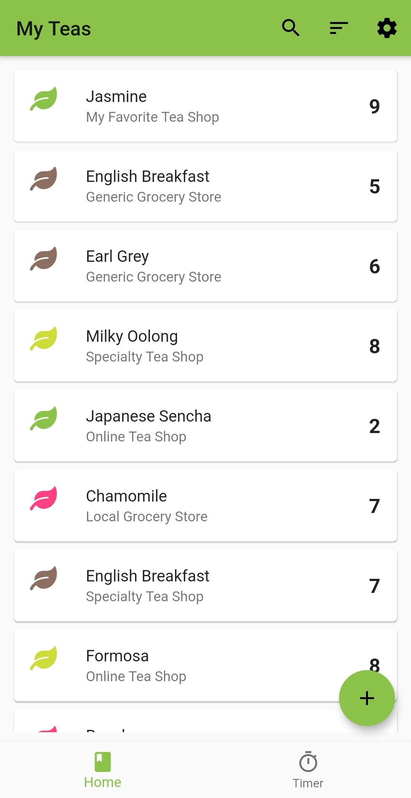
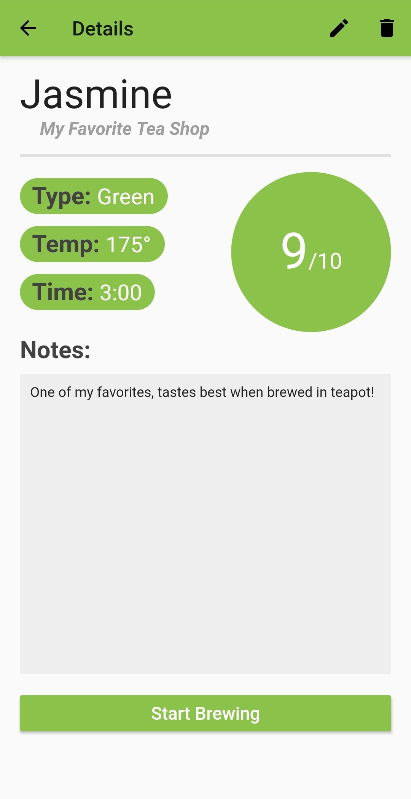
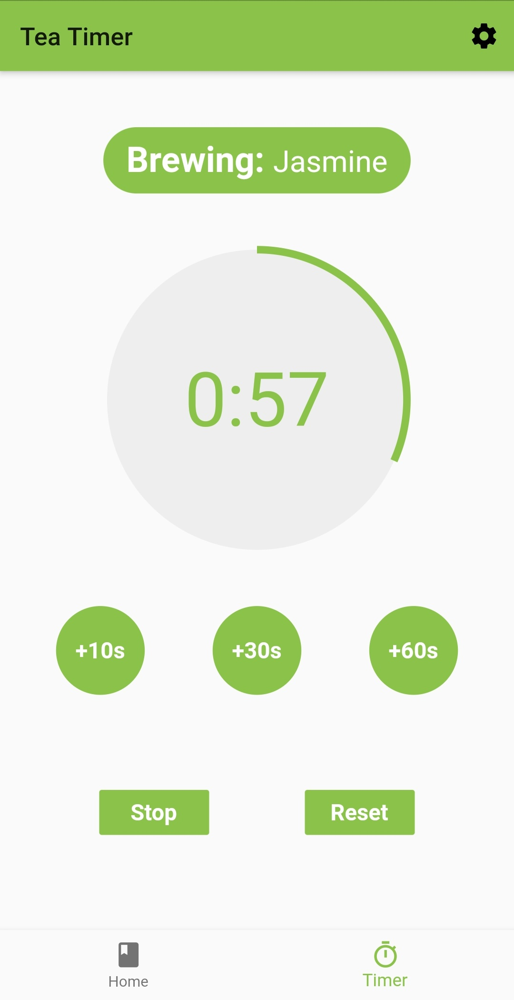

# Leaf Log
###### A modern log for all drinkers of tea.

## About

Leaf log is an Android app built with Flutter.

It helps you log any and all teas you may drink, keeping track of important information and allowing you to take notes for next time. It also includes a timer, which lets you brew your tea straight from the app!

	
	
	

## Background

This app is a personal project to help me learn the basics of [Flutter](flutter.dev). I've messed around with Android development in the past, but always got overwhelmed before finishing a project. After coming up with the idea for creating my own tea log, I discovered Flutter as a framework to help create beautiful, cross-platform apps. Flutter (and Dart) was relatively simple to learn, and it helped inspire the design of Leaf Log as well as facilitate its development.

Ultimately, I'm very glad I discovered Flutter, and I'm excited to see how it evolves and to work with it in the future.

## Get Leaf Log

I created Leaf Log as open source, since education was the main purpose of its development. This app will always be free, and it's my hope that people can use and enjoy it. For now, Leaf Log is only available on Android, but I've kept the code inclusive so an iOS version is possible in the future.

You can download Leaf Log today on the Play Store!

